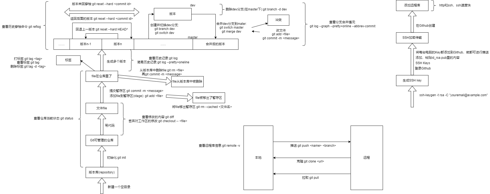

# Git总结

作者:AllForVoid

------

##  工作流

## 1. 本地操作

### 1.1 设置用户签名

- `git config --global user.name 用户名`
- `git config --global user.email 邮箱`

### 1.2 在目录中初始化仓库

1. 打开一个空目录，右键鼠标，Git Bash Here
2. 执行 `git init`

进行初始化完成后，会在目录中生成一个.git文件夹，终端提示符最后会增加一个"(master)"

### 1.3 提交更新到仓库

1. 编写代码

2. 编写完新文件后，执行 `git add <文件名>` ，将文件增加到暂存区

   把文件从暂存区中删除，执行 `git rm --cached <文件名>`

3. 可以使用通配符来代替文件名

4. 工作完毕，执行 `git commit -m <说明信息>` , 进行提交

### 1.4 查看本地库状态

- 使用 `git status` 查看当前本地库的状态

  包含当前分支；提交的东西；需要提交的东西等等

- 使用 `git reflog` 查看历史记录

### 1.5 历史版本穿梭

- 使用 `git reset --hard <版本号>` 在版本间穿梭
- 使用 `git reflog` 查看记录

### 1.6 查看分支

- 使用 `git branch -v` 查看分支信息，标*的是当前分支

### 1.7 切换分支

- 使用 `git checkout <分支名>` 或 `git switch <分支名>` 在分支之间切换

### 1.8 创建分支

- 使用 `git branch <分支名>` 创建分支
- 创建分支后使用 `git branch -v` 进行查看

### 1.9 分支合并(无冲突)

以将hot-fix分支合并到master分支上为例:

1. 先从hot-fix分支切换到master分支 `git chechout master`
2. 使用 `git merge <分支名>` 进行合并，即 `git merge hot-fix`

### 1.10 分支合并(冲突)

以将hot-fix分支合并到master分支上为例:

1. 先从hot-fix分支切换到master分支 `git chechout master`
2. 使用 `git merge <分支名>` 进行合并，即 `git merge hot-fix`
3. 提示冲突(CONFLICT)
4. 使用 `git status` 查看冲突位置，并打开文件进行解决
5. 使用 `git add <文件名>` 将文件添加到暂存区
6. 使用 `git commit -m <提示信息>` 提交
7. 提示符旁的"(master|MERGING)"变成"(master)"，解决冲突完毕，合并成功

## 2. 远程操作

使用GitHub

### 2.1 创建远程仓库

1. `sign in` 进行登录
2. 点击右上角的 `+`
3. `Repository name` 给远程库进行命名，一般和本地库名称一样
4. 选择远程库分类 `public` 还是 `private`
5. 点击 `Create repository` 创建远程库

### 2.2 创建远程库别名，关联

- 使用 `git remote -v` 查看现有的别名
- 使用 `git remote add <名称> <远程库链接>` 创建别名

### 2.3 推送代码

- 使用 `git push <别名或远程库链接> <分支名>` 将本地库代码推送到远程库
- 推送时需要在本地进行登录账号，或者在GitHub添加本地生成的公钥

### 2.4 拉取代码

- 使用 `git pull <别名> <分支名>` 从远程库拉取更新本地库

### 2.5 克隆

1. 在本地创建一个空目录
2. 执行 `git clone <远程库链接>`

公共库克隆代码不需要登录

克隆后的别名默认为origin

### 2.6 添加团队内协作者

1. 远程库作者进入远程库GitHub
2. 进入 `Setting`
3. 进入 `Manage access`
4. 点击 `Invite a collaborator`
5. 输入你要邀请的账号
6. 邀请，复制邀请函链接，发送给协作者
7. 协作者点击 `Accept invitation` 同意邀请

### 2.7 陌生人帮助改代码

1. 陌生人进入作者的远程库主页，点击 `fork` ，然后陌生人自己的远程库就拥有了相同的代码
2. 陌生人更改自己远程库的代码
3. 陌生人在自己的远程库主页点击 `Pull request` ，然后点击 `New pull request` 创建拉取请求
4. 点击 `Create pull request` ，编辑提交信息，写说明
5. 作者进入 `Pull request` ，发现新的请求，与陌生人进行交流
6. 点击 `Merge pull request` ，与陌生人的远程库进行合并，点击 `Confirm merge`
7. 作者的远程库就增加了陌生人的修改

### 2.8 SSH免密登录

1. 在本地执行 `ssh-keygen -t rsa -C <你的邮箱地址>` 生成密钥对
2. 打开用户目录的.ssh文件夹，打开id_rsa.pub公钥文件，复制全部内容
3. 进入GitHub，点击头像，进入 `SSH and GPG keys`
4. 点击 `New SSH key` 输入标题，再粘贴公钥到key里
5. 点击 `Add SSH key` 添加密钥

## 3. 团队协作

### 3.1 团队内协作

团队成员A,B

- A将自己的本地库推送(push)到代码托管中心
- B获得许可，与A成为一个团队，从代码托管中心克隆(clone)一份代码
- B将自己写的代码推送(push)到A的远程代码仓库

### 3.2 团队间协作

团队成员A；陌生人C

- A将代码推(push)送到远程库
- C将A的代码复制(fork)到自己的远程库
- C将复制(fork)的代码克隆(clone)到本地
- C写好了代码，将其推送(push)到自己的远程库
- C通过代码托管中心，向A发送拉去请求(pull request)，等待A进行审核
- A审核通过，将自己的远程库代码与C的远程库代码进行合并(merge)
- A拉取(pull)自己的远程看代码进行，对本地库代买进行更新

## 后续

